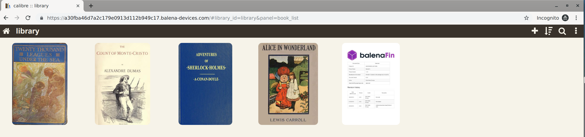

# Calibre server on a balena device

Run a [Calibre][calibre] e-book server on a [balena][balena] device!

## Usage

* Create an application for your chosen device type
* Deploy the code to the device using the [balenaCLI][balena-cli] (`balena push AppName`) or follow the docs on how to [deploy code][deploy code]
* Add a new device to that application
* Once the device shows up online, it should download the application images
* Add a new user to a device using the information below (either by the relevant environnment variables or command line helper tools)
* You can access your library at the device's IP address (over the `http` interface, on port 80) on the local network.
* If you enable the [Public Device URL][public device url] of the device, you will be able access your library remotely

On the local network, you can also use the [Calibre Companion][calibre companion] Android app to automatically discover and connect to the server.

### Adding and modifying users

* To add a user to the server (which is required before the server is first run), set a `USERNAME` and `PASSWORD` [environment or service variable][env var docs]. If you change the value of `PASSWORD`, the service will restart and the given user's password will be changed. If you change the username, a new user will be created with that name and password.
* To add more users or change permissions, etc, you can use the shipped `users.sh` convenience script which will stop the server, and run the Calibre user modification menu with the right settings. Once finished with that, just restart the service.

[balena]: http://balena.io/ "balenaCloud home page"
[balena-cli]: https://github.com/balena-io/balena-cli "balenaCLI repository and docs"
[calibre]: https://calibre-ebook.com/ "Calibre e-book management"
[calibre companion]: https://play.google.com/store/apps/details?id=com.multipie.calibreandroid "Calibre Companion on the Google Play Store"
[deploy code]: https://www.balena.io/docs/learn/getting-started/raspberrypi3/nodejs/#deploy-code "balena docs on deploying code"
[env var docs]: https://www.balena.io/docs/learn/manage/serv-vars/ "Environment and service variables in the balena documentation"
[public device url]: https://www.balena.io/docs/learn/manage/actions/#enable-public-device-url "Public Device URLs in the docs"